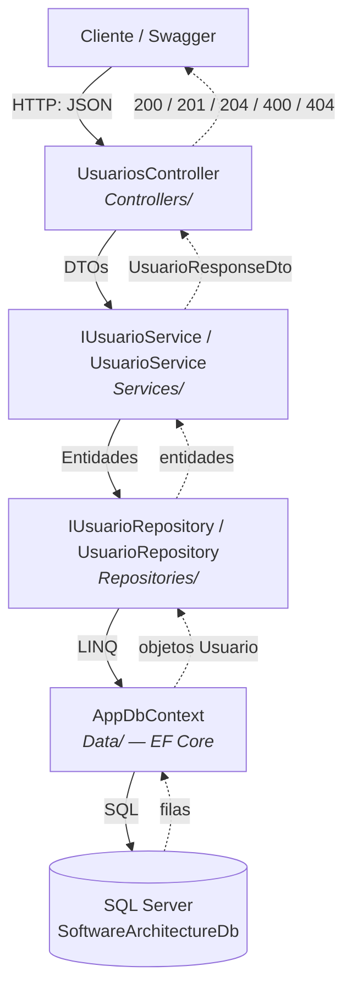
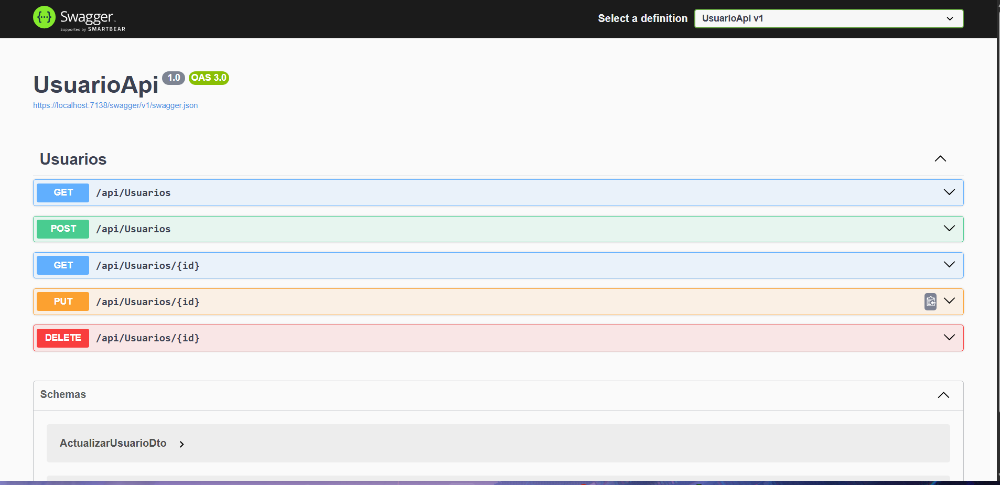
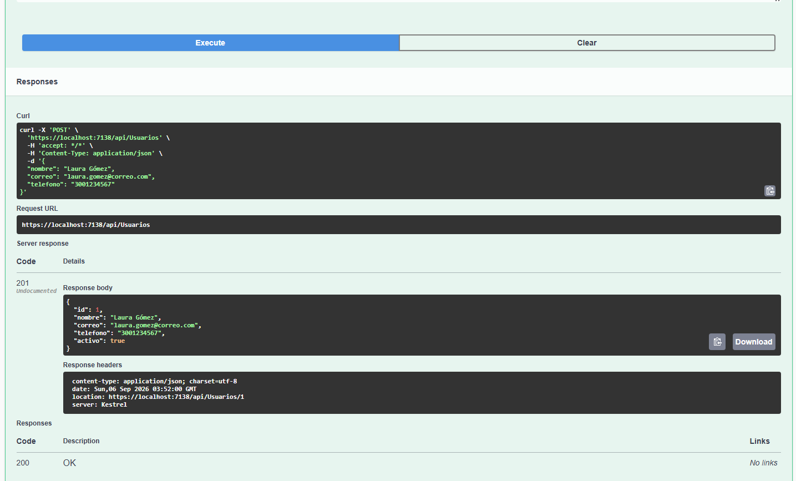
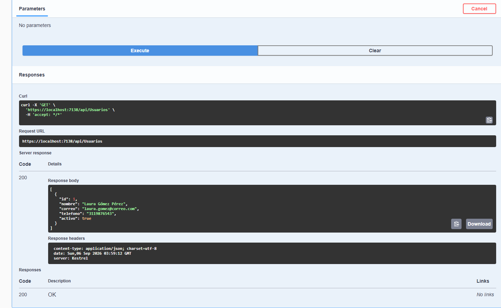
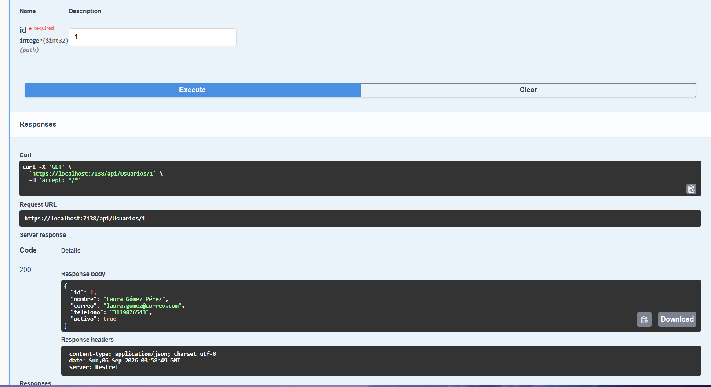
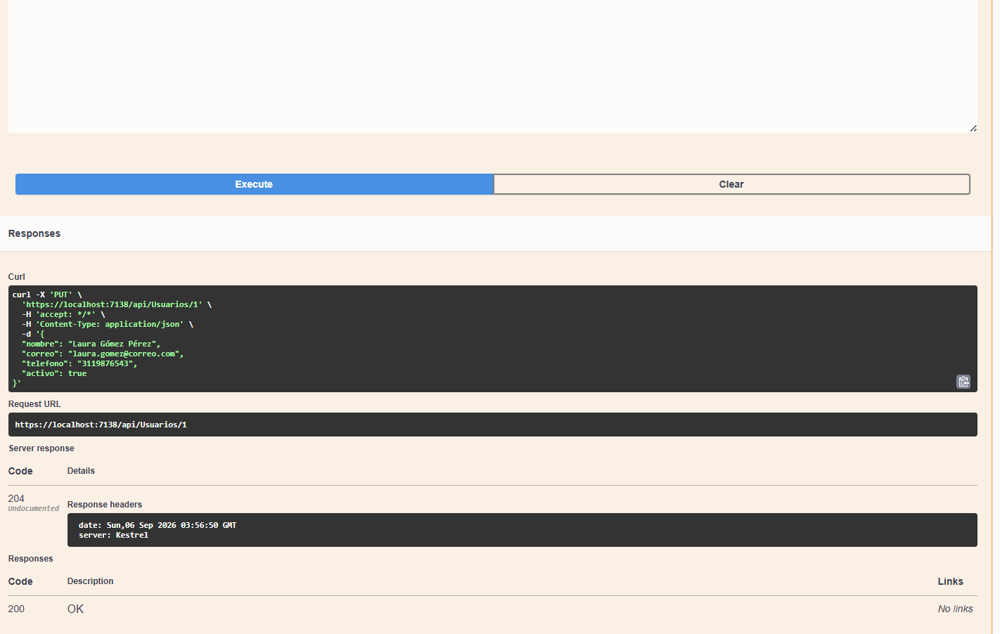
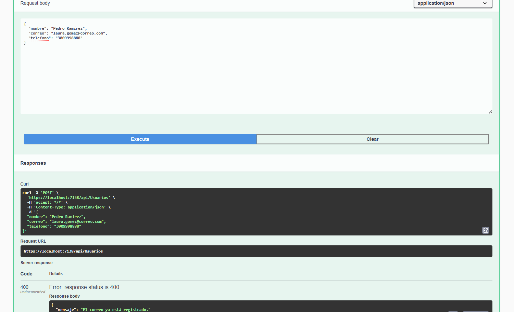
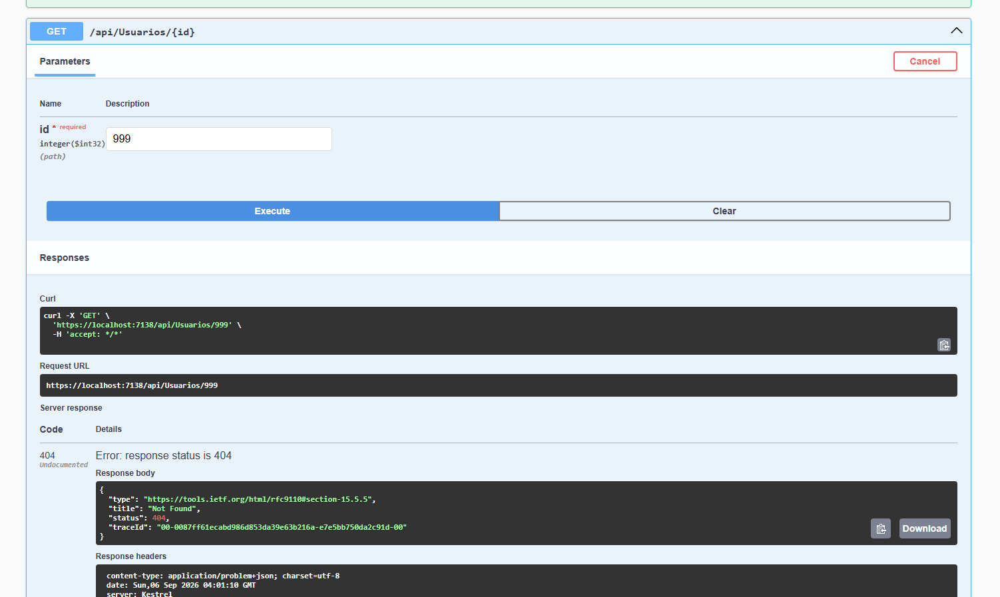

# UsuarioApi

API REST para la gestión de usuarios, desarrollada como **Taller Práctico No. 3 — De la Arquitectura al Código** de la asignatura *Software Architecture* (Ingeniería de Software, Uniempresarial).

El objetivo del taller no es solo que el CRUD funcione, sino que la estructura del código refleje una decisión arquitectónica: separación de responsabilidades por capas, uso de interfaces, DTOs e inyección de dependencias.

**Stack:** .NET 8 Web API · C# · Entity Framework Core 8 · SQL Server · Swagger (Swashbuckle)

---

## Arquitectura implementada



### Responsabilidad de cada capa

| Capa | Carpeta | Qué hace | Qué **no** hace |
|---|---|---|---|
| Controller | `Controllers/` | Recibe la petición HTTP, la delega y traduce el resultado a un código de estado | No consulta la base de datos ni contiene reglas de negocio |
| Service | `Services/` | Aplica el caso de uso y las reglas de negocio (correo único, límites de paginación, sellado de auditoría) | No conoce HTTP ni Entity Framework |
| Repository | `Repositories/` | Encapsula el acceso a datos: consultas, filtros y persistencia | No decide reglas de negocio |
| Data | `Data/` | Configura EF Core y expone el `DbSet<Usuario>` | No expone entidades fuera de la API |
| DTOs | `DTOs/` | Definen el contrato público de entrada y salida | No se persisten |
| Entities | `Entities/` | Representan las tablas de la base de datos | No se devuelven al cliente |
| Interfaces | `Interfaces/` | Definen los contratos entre capas | — |

El flujo depende siempre de **abstracciones** (`IUsuarioService`, `IUsuarioRepository`), nunca de implementaciones concretas. Las dependencias se resuelven en `Program.cs` mediante el contenedor de inyección de dependencias de ASP.NET Core.

---

## Estructura del proyecto

```
UsuarioApi/
├── Controllers/     UsuariosController.cs
├── Data/            AppDbContext.cs
├── DTOs/            CrearUsuarioDto, ActualizarUsuarioDto,
│                    UsuarioResponseDto, ResultadoPaginadoDto<T>
├── Entities/        Usuario.cs
├── Interfaces/      IUsuarioRepository.cs, IUsuarioService.cs
├── Migrations/      InitialCreate, AgregarFechaActualizacion
├── Repositories/    UsuarioRepository.cs
├── Services/        UsuarioService.cs
├── Program.cs       Registro de dependencias y pipeline HTTP
└── appsettings.json Cadena de conexión
```

---

## Requisitos

- [SDK de .NET 8](https://dotnet.microsoft.com/download/dotnet/8.0)
- SQL Server (LocalDB, Express o Developer)
- Herramienta `dotnet-ef`:
  ```bash
  dotnet tool install --global dotnet-ef
  ```

---

## Cómo ejecutar

### 1. Clonar y ubicarse en el proyecto

```bash
git clone https://github.com/MaYueLRz/ArquitecturaSoftwareCRUD.git
cd ArquitecturaSoftwareCRUD/UsuarioApi
```

### 2. Configurar la cadena de conexión

En `appsettings.json`. Por defecto usa **SQL Server LocalDB**:

```json
"ConnectionStrings": {
  "DefaultConnection": "Server=(localdb)\\MSSQLLocalDB;Database=SoftwareArchitectureDb;Trusted_Connection=True;TrustServerCertificate=True;"
}
```

Si usas una instancia local completa, cambia el `Server` por `localhost`. Si usas autenticación SQL, reemplázala por la de tu servidor — **no subas contraseñas reales al repositorio**.

### 3. Crear la base de datos

```bash
dotnet ef database update
```

Esto crea `SoftwareArchitectureDb` con la tabla `Usuarios`. Como alternativa, en la raíz está `script-base-datos.sql`, que puede ejecutarse directamente en SSMS o Azure Data Studio.

### 4. Confiar en el certificado de desarrollo (solo la primera vez)

```bash
dotnet dev-certs https --trust
```

Sin esto el navegador bloquea `https://localhost` con `ERR_CERT_AUTHORITY_INVALID`.

### 5. Levantar la API

```bash
dotnet run --launch-profile https
```

Swagger queda disponible en **https://localhost:7138/swagger**

---

## Endpoints

| Método | Endpoint | Acción | Respuestas |
|---|---|---|---|
| `GET` | `/api/usuarios` | Listar con búsqueda y paginación | `200` |
| `GET` | `/api/usuarios/{id}` | Consultar por Id | `200` · `404` |
| `POST` | `/api/usuarios` | Crear usuario | `201` · `400` |
| `PUT` | `/api/usuarios/{id}` | Actualizar usuario | `204` · `404` |
| `DELETE` | `/api/usuarios/{id}` | Eliminar usuario | `204` · `404` |

### Parámetros del listado

| Parámetro | Tipo | Por defecto | Descripción |
|---|---|---|---|
| `buscar` | `string?` | `null` | Filtra por coincidencia parcial en nombre **o** correo |
| `pagina` | `int` | `1` | Número de página (valores menores a 1 se corrigen a 1) |
| `tamanoPagina` | `int` | `10` | Registros por página (máximo 50) |

Ejemplo: `GET /api/usuarios?buscar=laura&pagina=1&tamanoPagina=5`

### Ejemplos de uso

**Crear** — `POST /api/usuarios`

```json
{
  "nombre": "Laura Gómez",
  "correo": "laura.gomez@correo.com",
  "telefono": "3001234567"
}
```

**Actualizar** — `PUT /api/usuarios/1`

```json
{
  "nombre": "Laura Gómez Pérez",
  "correo": "laura.gomez@correo.com",
  "telefono": "3119876543",
  "activo": true
}
```

**Respuesta del listado paginado**

```json
{
  "items": [
    {
      "id": 1,
      "nombre": "Laura Gómez Pérez",
      "correo": "laura.gomez@correo.com",
      "telefono": "3119876543",
      "activo": true,
      "fechaCreacion": "2026-09-06T04:33:30.7013889",
      "fechaActualizacion": "2026-09-06T04:33:47.4144393"
    }
  ],
  "pagina": 1,
  "tamanoPagina": 10,
  "totalRegistros": 1,
  "totalPaginas": 1
}
```

---

## Reglas de negocio

- **Correo único:** no se puede crear un usuario con un correo ya registrado. Se valida en `UsuarioService.CrearAsync` y el Controller la traduce a `400 Bad Request` con el mensaje `"El correo ya está registrado."`
- **Normalización:** al crear y actualizar, el correo se guarda en minúsculas y los campos de texto se recortan con `Trim()`.
- **Límites de paginación:** `pagina` nunca es menor a 1 y `tamanoPagina` se limita a 50 para evitar consultas masivas.

---

## Reto adicional

Se implementaron tres de las mejoras propuestas en la sección 20 del taller:

### 1. Búsqueda por nombre o correo

`GET /api/usuarios?buscar=<término>` filtra por coincidencia parcial en ambos campos. El filtro se construye sobre `IQueryable` en el Repository, por lo que **se traduce a SQL y se ejecuta en el motor de base de datos**, no en memoria. La búsqueda no distingue mayúsculas por la colación por defecto de SQL Server.

### 2. Paginación

El listado devuelve un `ResultadoPaginadoDto<T>` con los metadatos necesarios para navegar (`pagina`, `tamanoPagina`, `totalRegistros`, `totalPaginas`). El Repository aplica `Skip`/`Take` y cuenta el total **antes** de paginar; el Service valida los límites.

### 3. Auditoría con `FechaActualizacion`

La entidad `Usuario` incorpora `DateTime? FechaActualizacion`, que permanece en `null` hasta la primera modificación y se sella en `UsuarioService.ActualizarAsync`. El `UsuarioResponseDto` expone tanto `FechaCreacion` como `FechaActualizacion`, de modo que el cliente puede auditar el ciclo de vida del registro.

> **Dónde vive cada cosa y por qué:** el *filtrado* y el `Skip`/`Take` son responsabilidad del Repository, porque describen **cómo se consulta** la base de datos. Los *límites* de paginación y el *sellado* de la fecha son responsabilidad del Service, porque son **decisiones de negocio**. El Controller solo recibe los parámetros y los pasa hacia abajo.

---

## Base de datos

| Columna | Tipo | Notas |
|---|---|---|
| `Id` | `int` | PK, IDENTITY |
| `Nombre` | `nvarchar(max)` | requerido |
| `Correo` | `nvarchar(max)` | requerido, único por regla de negocio |
| `Telefono` | `nvarchar(max)` | requerido |
| `Activo` | `bit` | `true` por defecto |
| `FechaCreacion` | `datetime2` | `DateTime.UtcNow` al crear |
| `FechaActualizacion` | `datetime2` | **nullable**, se sella en cada actualización |

Migraciones aplicadas:

1. `InitialCreate` — crea la tabla `Usuarios`
2. `AgregarFechaActualizacion` — agrega la columna de auditoría

El archivo `script-base-datos.sql` (en la raíz del repositorio) contiene el script idempotente completo para recrear el esquema.

---

## Evidencias

Capturas de Swagger que demuestran las cinco operaciones CRUD, el manejo de errores y las mejoras del reto adicional.

### Vista general



### Operaciones CRUD

| Operación | Código | Captura |
|---|---|---|
| Crear usuario | `201 Created` |  |
| Listar usuarios | `200 OK` |  |
| Consultar por Id | `200 OK` |  |
| Actualizar usuario | `204 No Content` |  |
| Eliminar usuario | `204 No Content` |  |

### Manejo de errores

| Caso | Código | Captura |
|---|---|---|
| Correo duplicado | `400 Bad Request` |  |
| Usuario inexistente | `404 Not Found` |  |

### Reto adicional

| Mejora | Captura |
|---|---|
| Búsqueda por nombre o correo |  |
| Paginación |  |
| Auditoría con `FechaActualizacion` |  |

### Base de datos

| Evidencia | Captura |
|---|---|
| Tabla `Usuarios` en SQL Server |  |

---

## Respuestas de análisis

Las respuestas a las 10 preguntas obligatorias (sección 19 del taller) están en
**[docs/respuestas-analisis.md](docs/respuestas-analisis.md)**, con referencias al código de este repositorio
y un diagrama de secuencia del recorrido completo de una petición `POST`.

---

## Autor

Samuel González Rodríguez — Software Architecture, Uniempresarial.
