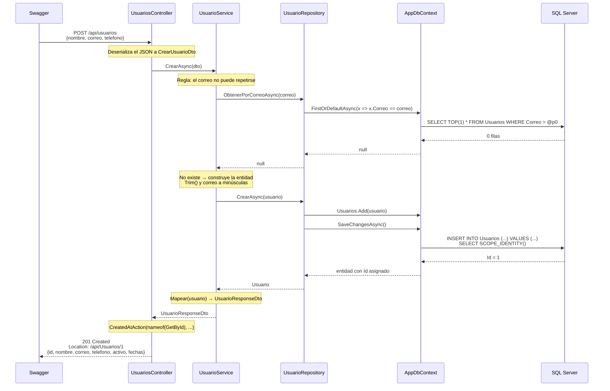

# Respuestas a las preguntas de análisis

**Taller Práctico No. 3 — De la Arquitectura al Código**
Software Architecture · Ingeniería de Software · Uniempresarial
Samuel González Rodríguez

Las respuestas hacen referencia al código de este mismo repositorio.

---

## 1. ¿Por qué `UsuariosController` no debería consultar directamente `AppDbContext`?

Porque rompería la separación de responsabilidades sobre la que está construida toda la arquitectura. El Controller es la capa de **transporte**: su trabajo es traducir entre el mundo HTTP y el mundo de la aplicación. Si además consultara la base de datos, quedaría atado a tres responsabilidades distintas al mismo tiempo — atender HTTP, aplicar reglas de negocio y persistir datos.

Las consecuencias concretas de hacerlo serían:

- **Acoplamiento a Entity Framework.** El Controller pasaría a depender de una tecnología de persistencia. Cambiar de ORM obligaría a reescribir los controladores, que no tienen nada que ver con eso.
- **Lógica duplicada.** La regla de correo único tendría que repetirse en cada endpoint que cree o actualice usuarios. Hoy vive en un solo lugar: `UsuarioService.CrearAsync`.
- **Imposible de probar sin base de datos.** Un `DbContext` necesita una conexión real o un proveedor en memoria. Al depender de `IUsuarioService`, el Controller se puede probar con un doble de prueba (ver pregunta 8).
- **Fuga de entidades.** Tener el `DbContext` a la mano invita a devolver la entidad `Usuario` directamente, exponiendo campos internos (ver pregunta 3).

En este proyecto el Controller solo conoce `IUsuarioService`, y ni siquiera sabe que existe Entity Framework: en `UsuariosController.cs` no hay un solo `using Microsoft.EntityFrameworkCore`.

---

## 2. ¿Qué principio SOLID se evidencia al depender de `IUsuarioRepository` en lugar de `UsuarioRepository`?

El **Principio de Inversión de Dependencias (DIP)**, la *D* de SOLID:

> Los módulos de alto nivel no deben depender de módulos de bajo nivel. Ambos deben depender de abstracciones.

`UsuarioService` es el módulo de alto nivel (contiene el caso de uso) y `UsuarioRepository` el de bajo nivel (habla con la base de datos). Sin la interfaz, el Service dependería directamente del detalle de infraestructura. Con `IUsuarioRepository` de por medio, **ambos dependen de la abstracción** y la dirección de la dependencia se invierte: ahora es el repositorio el que se acomoda al contrato que el Service necesita.

La conexión concreta se hace una sola vez, en `Program.cs`:

```csharp
builder.Services.AddScoped<IUsuarioRepository, UsuarioRepository>();
builder.Services.AddScoped<IUsuarioService, UsuarioService>();
```

Ese es el único punto del sistema que conoce las implementaciones concretas.

De paso se evidencian otros dos principios:

- **Responsabilidad Única (SRP):** cada clase tiene una sola razón para cambiar. El Repository cambia si cambia la persistencia; el Service, si cambian las reglas de negocio.
- **Sustitución de Liskov (LSP):** cualquier implementación de `IUsuarioRepository` puede reemplazar a otra sin que el Service se entere. Eso es justo lo que permite probarlo con un repositorio simulado.

**Evidencia práctica en este proyecto:** durante el reto adicional reemplacé `ObtenerTodosAsync()` por `BuscarAsync(buscar, pagina, tamanoPagina)` en `IUsuarioRepository`. Cambió el contrato y cambió la implementación, pero el Controller **no se modificó por ese motivo**: solo pasó los nuevos parámetros hacia abajo. Esa es la ganancia del DIP, medida en archivos que no hubo que tocar.

---

## 3. ¿Qué ventaja ofrece usar DTOs en lugar de devolver la entidad `Usuario`?

Los DTOs separan el **contrato público de la API** del **modelo de persistencia**, que son dos cosas que cambian por razones distintas y a ritmos distintos.

Ventajas concretas:

| Ventaja | Ejemplo en este proyecto |
|---|---|
| **Control de lo que se expone** | La entidad podría tener campos internos (una contraseña, un token, un identificador de auditoría) que jamás deberían viajar en un JSON |
| **Contratos distintos según la operación** | `CrearUsuarioDto` no incluye `Id` ni `Activo` — el cliente no debe elegir el Id, lo asigna la base de datos. `ActualizarUsuarioDto` sí incluye `Activo`, porque en ese caso sí es una decisión del cliente |
| **Independencia entre capas** | Puedo agregar una columna a la tabla sin cambiar el JSON que reciben los clientes, y viceversa |
| **Evita ciclos de serialización** | Con relaciones entre entidades (`Usuario → Pedidos → Usuario`), serializar la entidad directamente produce referencias circulares |
| **Documentación honesta** | Swagger muestra exactamente los campos del contrato, no la estructura interna de la tabla |

Un caso real del taller: `CrearUsuarioDto` pide solo nombre, correo y teléfono. Si devolviera la entidad, el cliente vería `FechaCreacion` y podría creer que puede enviarla. Con el DTO, el contrato es explícito: esa fecha la pone el servidor.

---

## 4. ¿En qué componente ubicó la regla de correo único y por qué?

En el **Service**, en `UsuarioService.CrearAsync`:

```csharp
var existente = await _repository.ObtenerPorCorreoAsync(dto.Correo);
if (existente is not null)
    throw new InvalidOperationException("El correo ya está registrado.");
```

**Por qué ahí y no en otro lado:**

- **No en el Controller,** porque no es una regla de HTTP sino del negocio. Si mañana los usuarios también se crearan desde una tarea programada, un comando de consola o un consumidor de mensajes, la regla debe aplicarse igual. Puesta en el Controller, solo protegería a quien entre por HTTP.
- **No en el Repository,** porque el repositorio responde *cómo se guardan* los datos, no *qué es válido*. Su trabajo es persistir lo que le pidan.
- **Sí en el Service,** porque es el dueño del caso de uso "registrar un usuario" y el único punto por el que pasan todas las creaciones.

El Controller solo **traduce** esa excepción de negocio a un código HTTP:

```csharp
catch (InvalidOperationException ex)
{
    return BadRequest(new { mensaje = ex.Message });
}
```

Cada capa habla su propio idioma: el Service lanza una excepción de dominio, el Controller la convierte en un `400`.

**Complemento a nivel de base de datos:** lo más robusto sería añadir además un índice único sobre `Correo` en `AppDbContext`. La validación del Service da un mensaje claro al usuario; el índice garantiza la integridad incluso ante dos peticiones simultáneas que pasen la validación al mismo tiempo. Las dos se complementan: una es experiencia de usuario, la otra es integridad de datos.

---

## 5. ¿Qué tendría que cambiar si mañana SQL Server se reemplaza por otra tecnología?

**Cambiaría solo la capa de infraestructura.** En concreto:

| Archivo | Cambio |
|---|---|
| `appsettings.json` | La cadena de conexión |
| `Program.cs` | `options.UseSqlServer(...)` → `UseNpgsql(...)`, `UseSqlite(...)`, etc. |
| `UsuarioApi.csproj` | El paquete del proveedor de EF Core |
| `Migrations/` | Regenerar las migraciones para el nuevo motor |

**No cambiaría nada de esto:** `UsuariosController`, `UsuarioService`, los DTOs, `IUsuarioRepository` ni `IUsuarioService`.

Si el cambio fuera a otro motor **relacional** (PostgreSQL, MySQL, SQLite), `UsuarioRepository` tampoco cambiaría, porque las consultas están escritas en LINQ y es EF Core quien las traduce al dialecto SQL correspondiente.

Si el cambio fuera a algo **no relacional** (MongoDB, un API externo, un archivo), habría que escribir una nueva implementación de `IUsuarioRepository` —por ejemplo `UsuarioRepositoryMongo`— y cambiar una sola línea en `Program.cs`:

```csharp
builder.Services.AddScoped<IUsuarioRepository, UsuarioRepositoryMongo>();
```

El Service seguiría funcionando sin enterarse, porque depende del contrato, no de la implementación. **Ese es exactamente el beneficio que justifica tener la interfaz**: el costo del cambio queda acotado a una capa en lugar de propagarse por todo el sistema.

---

## 6. ¿Qué código HTTP retorna cada endpoint y por qué?

| Método | Endpoint | Código | Por qué |
|---|---|---|---|
| `GET` | `/api/usuarios` | **200 OK** | La consulta se resolvió y devuelve una representación. Una lista vacía sigue siendo `200`: "no hay usuarios" es una respuesta válida, no un error |
| `GET` | `/api/usuarios/{id}` | **200 OK** | El recurso existe y se devuelve |
| | | **404 Not Found** | El recurso solicitado no existe. El cliente pidió algo identificable que no está |
| `POST` | `/api/usuarios` | **201 Created** | Se creó un recurso nuevo. Incluye el header `Location` con su URL, generado por `CreatedAtAction` |
| | | **400 Bad Request** | El cliente envió datos que violan una regla de negocio (correo duplicado). El error es del cliente, no del servidor |
| `PUT` | `/api/usuarios/{id}` | **204 No Content** | La actualización tuvo éxito y no hay nada que devolver. El cliente ya sabe lo que envió |
| | | **404 Not Found** | No existe el usuario que se intenta actualizar |
| `DELETE` | `/api/usuarios/{id}` | **204 No Content** | La eliminación tuvo éxito y no queda recurso que representar |
| | | **404 Not Found** | No existe el usuario que se intenta eliminar |

**Criterios de fondo:**

- La familia **2xx** confirma éxito. Dentro de ella, `201` comunica algo que `200` no: *se creó un recurso nuevo, y está aquí*. Y `204` es más honesto que devolver `200` con un cuerpo vacío.
- La familia **4xx** atribuye el error **al cliente**. `400` significa "lo que enviaste no es aceptable"; `404`, "lo que pediste no existe". La distinción importa: con `400` el cliente debe corregir los datos, con `404` debe corregir la URL.
- La familia **5xx** atribuye el error al servidor. En esta API no se retorna explícitamente: aparecería solo ante una falla no controlada, por ejemplo si la base de datos estuviera caída.

---

## 7. ¿Dónde agregaría una validación para impedir nombres vacíos?

Depende de qué tipo de validación sea, y lo correcto es aplicarla **en dos niveles distintos**, porque responden preguntas diferentes.

### Nivel 1 — Validación de formato, en el DTO

Es validación de *entrada*: ¿el mensaje que llegó está bien formado? Se declara con anotaciones sobre el DTO:

```csharp
public record CrearUsuarioDto(
    [Required(ErrorMessage = "El nombre es obligatorio.")]
    [StringLength(100, MinimumLength = 3)]
    string Nombre,

    [Required][EmailAddress]
    string Correo,

    [Required][Phone]
    string Telefono
);
```

Gracias al atributo `[ApiController]`, ASP.NET Core evalúa el `ModelState` **antes** de entrar al método del Controller y responde `400` automáticamente con el detalle de los campos inválidos. La petición ni siquiera llega al Service.

### Nivel 2 — Validación de negocio, en el Service

Es validación de *reglas*: ¿esto tiene sentido para el negocio? Va en `UsuarioService`, junto a la regla de correo único:

```csharp
if (string.IsNullOrWhiteSpace(dto.Nombre))
    throw new InvalidOperationException("El nombre es obligatorio.");
```

### Por qué los dos

El DTO protege el **contrato HTTP**, pero solo cubre a quien entra por HTTP. El Service protege el **caso de uso**, sin importar quién lo invoque — una tarea programada, una prueba, otro módulo. Si la regla vive únicamente en el DTO y mañana se crean usuarios desde un proceso interno, nada impediría un nombre vacío.

**Dónde no ponerla:** en el Repository. Para cuando los datos llegan ahí ya se dan por válidos; su trabajo es persistir, no juzgar.

---

## 8. ¿Cómo probaría `UsuarioService` sin conectarse a SQL Server?

Sustituyendo `IUsuarioRepository` por un **doble de prueba**. Como el Service depende de la interfaz y la recibe por constructor, en una prueba puedo pasarle cualquier implementación:

```csharp
public class UsuarioServiceTests
{
    [Fact]
    public async Task CrearAsync_LanzaExcepcion_CuandoElCorreoYaExiste()
    {
        // Arrange: el repositorio simulado dice que el correo ya está tomado
        var repositorio = new Mock<IUsuarioRepository>();
        repositorio
            .Setup(r => r.ObtenerPorCorreoAsync("laura.gomez@correo.com"))
            .ReturnsAsync(new Usuario { Id = 1, Correo = "laura.gomez@correo.com" });

        var servicio = new UsuarioService(repositorio.Object);
        var dto = new CrearUsuarioDto("Laura", "laura.gomez@correo.com", "3001234567");

        // Act + Assert
        await Assert.ThrowsAsync<InvalidOperationException>(
            () => servicio.CrearAsync(dto));
    }

    [Fact]
    public async Task ObtenerTodosAsync_LimitaElTamanoDePagina_A50()
    {
        var repositorio = new Mock<IUsuarioRepository>();
        repositorio
            .Setup(r => r.BuscarAsync(null, 1, 50))
            .ReturnsAsync((new List<Usuario>(), 0));

        var servicio = new UsuarioService(repositorio.Object);

        var resultado = await servicio.ObtenerTodosAsync(null, 1, 999);

        Assert.Equal(50, resultado.TamanoPagina);
    }
}
```

También se puede hacer sin librerías de *mocking*, escribiendo una clase que implemente `IUsuarioRepository` con una `List<Usuario>` en memoria.

**Por qué es posible:** porque el Service nunca instancia su dependencia con `new UsuarioRepository(...)`. La recibe desde afuera. Si estuviera acoplado a la clase concreta, cada prueba necesitaría una base de datos real — sería lenta, frágil y dependería del estado previo de las tablas.

**Qué se gana:** las pruebas corren en milisegundos, no necesitan SQL Server instalado, y verifican **la lógica del Service de forma aislada**. Si una falla, el problema está en el Service y en ningún otro lado.

---

## 9. ¿Qué responsabilidad tiene `AppDbContext`?

`AppDbContext` es el **puente entre el modelo de objetos de C# y las tablas de SQL Server**. Hereda de `DbContext` de Entity Framework Core y concentra estas funciones:

```csharp
public class AppDbContext : DbContext
{
    public AppDbContext(DbContextOptions<AppDbContext> options) : base(options) { }

    public DbSet<Usuario> Usuarios => Set<Usuario>();
}
```

| Responsabilidad | Qué significa |
|---|---|
| **Mapeo objeto-relacional** | Declara que la entidad `Usuario` corresponde a la tabla `Usuarios` |
| **Traducción de consultas** | Convierte las expresiones LINQ del Repository en sentencias SQL |
| **Seguimiento de cambios** | Rastrea las entidades cargadas y detecta cuáles fueron modificadas |
| **Unidad de trabajo** | `SaveChangesAsync()` agrupa todos los cambios pendientes en una sola transacción |
| **Origen de las migraciones** | EF Core compara el modelo declarado aquí con el estado de la base para generar las migraciones |

El **seguimiento de cambios** explica algo que a primera vista parece un error en `UsuarioRepository.ActualizarAsync`:

```csharp
public async Task ActualizarAsync(Usuario usuario)
{
    await _context.SaveChangesAsync();   // no hay Update(usuario)
}
```

No hace falta un `Update` explícito porque la entidad se obtuvo con `ObtenerPorIdAsync`, que la trae **rastreada** por el contexto. EF Core ya sabe qué propiedades cambiaron y genera el `UPDATE` con solo esas columnas.

Es también la razón por la que `ObtenerTodosAsync` usa `AsNoTracking()`: en una consulta de solo lectura el seguimiento es trabajo desperdiciado, y desactivarlo mejora el rendimiento.

**Lo que `AppDbContext` no hace:** no contiene reglas de negocio ni decide qué se expone al cliente. Es infraestructura pura.

---

## 10. Recorrido completo de una petición `POST` desde Swagger hasta SQL Server y de regreso



### Explicación paso a paso

1. **Swagger envía la petición.** `POST /api/usuarios` con el JSON en el cuerpo y `Content-Type: application/json`.
2. **ASP.NET Core rutea y deserializa.** El *model binder* convierte el JSON en un `CrearUsuarioDto`. Si el JSON estuviera mal formado, el `[ApiController]` respondería `400` sin llegar al método.
3. **El Controller delega.** No valida ni consulta nada; llama a `_service.CrearAsync(dto)`.
4. **El Service aplica la regla de negocio.** Antes de crear, pregunta al repositorio si el correo ya existe.
5. **El Repository consulta.** Traduce la pregunta a LINQ sobre el `DbSet`.
6. **EF Core genera el SQL** y lo envía por la conexión configurada en `appsettings.json`.
7. **SQL Server responde** que no hay coincidencias.
8. **El Service construye la entidad**, normalizando los datos: `Trim()` en todos los campos y el correo en minúsculas. `Activo` queda en `true` y `FechaCreacion` en `DateTime.UtcNow` por los valores por defecto de la entidad.
9. **El Repository persiste.** `Add` marca la entidad como nueva y `SaveChangesAsync` ejecuta el `INSERT` dentro de una transacción.
10. **SQL Server devuelve el Id generado** por la columna IDENTITY, y EF Core lo asigna a la entidad en memoria.
11. **El Service mapea a DTO.** La entidad no sale de esta capa; se convierte en `UsuarioResponseDto`.
12. **El Controller responde `201 Created`** con el header `Location` apuntando al recurso recién creado.

### Qué demuestra este recorrido

Cada capa **solo habla con su vecina inmediata** y en su propio lenguaje:

| Frontera | Lenguaje |
|---|---|
| Swagger ↔ Controller | JSON / HTTP |
| Controller ↔ Service | DTOs |
| Service ↔ Repository | Entidades |
| Repository ↔ DbContext | LINQ |
| DbContext ↔ SQL Server | SQL |

Ninguna capa se salta a la siguiente, y ninguna conoce los detalles de las que están dos niveles más abajo. El Controller no sabe que existe SQL Server; el Repository no sabe que la petición vino por HTTP. Eso es lo que hace que cada pieza se pueda cambiar, probar y entender por separado.
